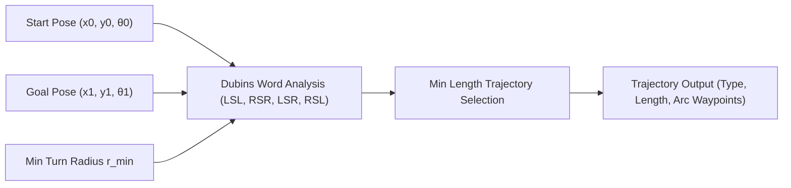

# Dubins Path Nonholonomic Trajectory Generator Skill

Analytical shortest path solver for wheeled mobile robots subject to nonholonomic curvature constraints.

## Features
- **100% Python Standard Library**: Analytical tangent circle mathematics.
- **Dubins Words**: LSL, RSR, LSR, RSL candidate path evaluations.
- **Fast Deterministic Solvers**: Instantaneous path generation for autonomous navigation.
